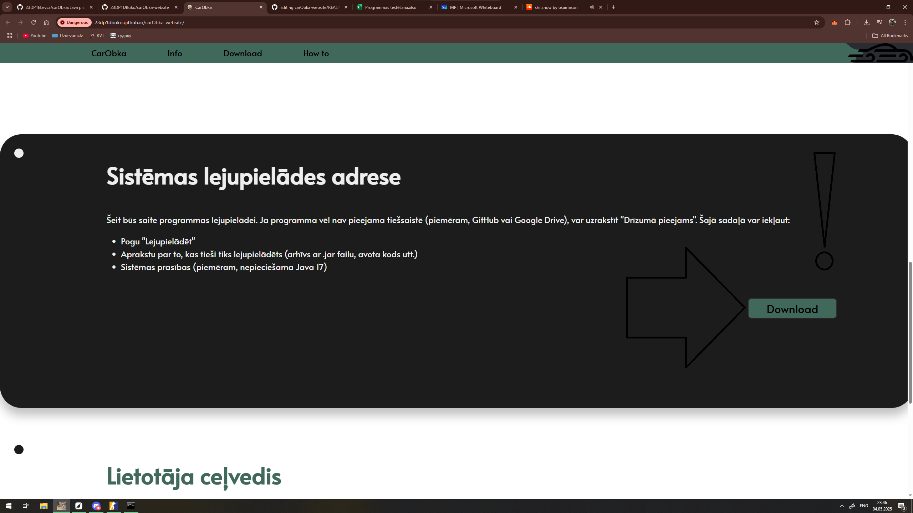
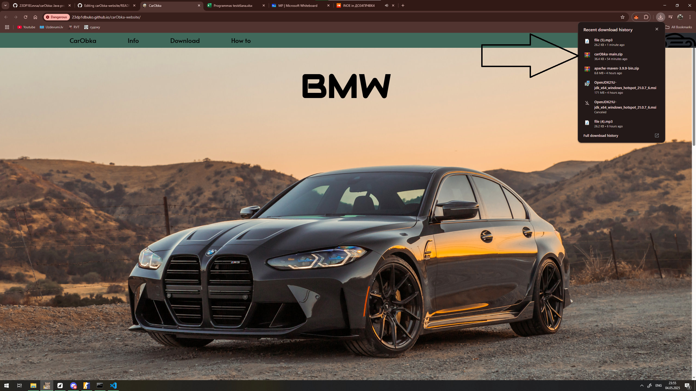
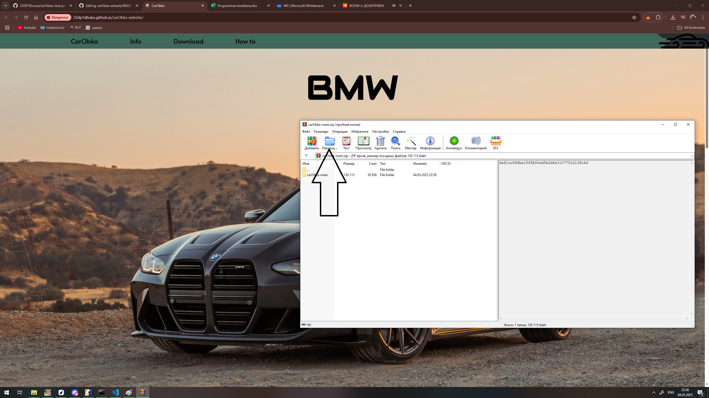
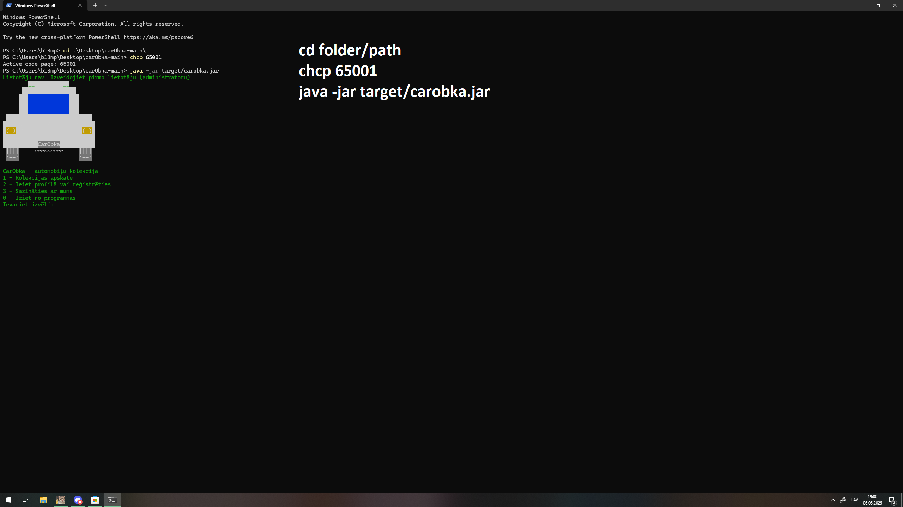

# CarObka Website 🌐

 <br>
[](#) <br>


```
           .      ..
   __..---/______//-----.
 .".--.```|    - /.--.  =:
(.: {} :__L______: {} :__;
   *--*           *--*    CarObka
```

## 👥 Autori

- **Eduards Levša** <br> [](https://github.com/23DP1ELevsa)
- **Deniss Bukovskis** <br> [](https://github.com/23DP1DBuko)

## 📝 Apraksts

CarObka oficiālā tīmekļa vietne sniedz informāciju par mūsu konsoles lietotni automašīnu pārvaldībai. Vietne sastāv no 6 sadaļām:

1. **Header** - Navigācijas josla ar logo un saites
2. **Hero** - Ievada sadaļa ar galveno aicinājumu
3. **Info** - Detalizēta informācija par programmas funkcijām
4. **Download** - Lejupielādes sadaļa ar instrukcijām
5. **How-to** - Lietošanas pamācība ar ekrānuzņēmumiem
6. **Footer** - Kontaktinformācija un saites

## 🛠 Instalācija

1. Lejupielādējiet programmu caur mūsu vietni: <br><br>
    <br><br>
2. Atveriet lejupielādēto zip-mapi: <br><br>
    <br><br>
3. Izvelciet mapi savā datorā: <br><br>
    <br><br>
4. Atveriet terminālu un ievadiet komandas:
   ```bash
   cd folder\path
   chcp 65001
   mvn compile exec:java
   ```
   

## 📩 Kontakti

- E-pasts: carobka52@gmail.com <br><br>
  [](https://github.com/23DP1ELevsa/carObka) <br>
  [](https://23dp1dbuko.github.io/carObka-website/) <br><br><br>

---
<br><br>
# CarObka Website 🌐 [ENG]

```
           .      ..
   __..---/______//-----.
 .".--.```|    - /.--.  =:
(.: {} :__L______: {} :__;
   *--*           *--*    CarObka
```

## 👥 Authors

- **Eduards Levša** <br> [](https://github.com/23DP1ELevsa)
- **Deniss Bukovskis** <br> [](https://github.com/23DP1DBuko)

## 📝 Description

The official CarObka website provides information about our console-based car management application. The website consists of 6 sections:

1. **Header** - Navigation bar with logo and links
2. **Hero** - Introductory section with main call-to-action
3. **Info** - Detailed information about program features
4. **Download** - Download section with instructions
5. **How-to** - Usage guide with screenshots
6. **Footer** - Contact information and links

## 🛠 Installation

1. Download the program from our website: <br><br>
    <br><br>
2. Open the downloaded ZIP folder: <br><br>
    <br><br>
3. Extract the folder to your computer: <br><br>
    <br><br>
4. Open a terminal and enter the following commands:
   ```bash
   cd folder\path
   chcp 65001
   mvn compile exec:java
   ```
   

## 📩 Contacts

- E-mail: carobka52@gmail.com <br><br>
  [](https://github.com/23DP1ELevsa/carObka) <br>
  [](https://23dp1dbuko.github.io/carObka-website/) <br><br><br>
